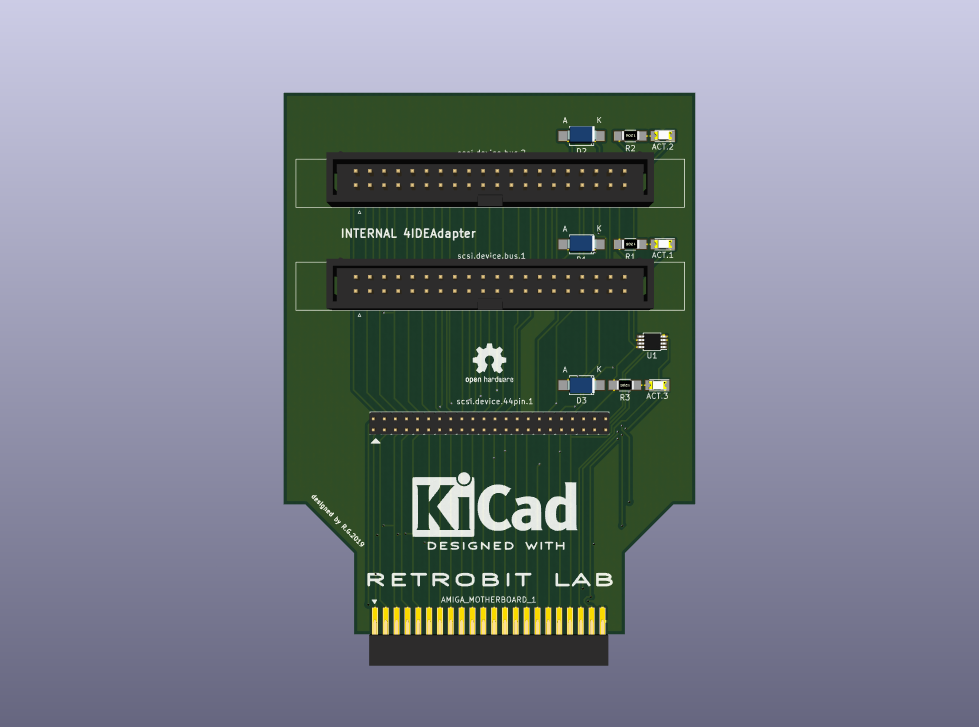
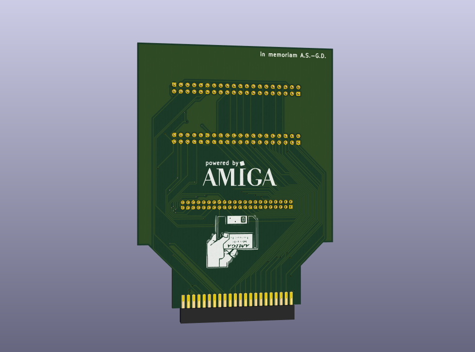

# Amiga 4 IDE Hard Parallel ATA Adapter
Created by Gianluca Renzi (C) 2019
E-Mail:
<icjtqr@gmail.com>
<gianlucarenzi@eurek.it>

# What is it?
It is a simple but powerful adapter to use internally in any Amiga 1200 or Amiga 600 Computer!
It must be connected to the IDE 44-pin interface on the motherboard to drive up to 4 ATA/ATAPI
devices like Hard Drives, DVD Rom Drives and compatible drives.
This project follow the same DIY project in Aminet.

# Images

# Whats changed?
V1.0 Initial release

# Licence
This entire project is available under the GNU General Public License v3 licence.
See licence.txt for more details.
