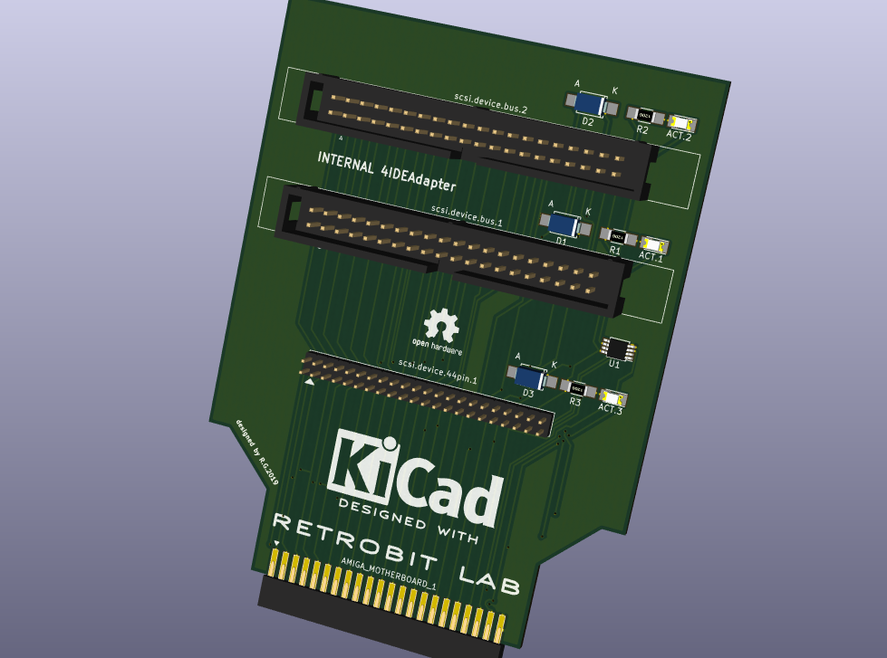

# Amiga 4 IDE Hard Parallel ATA Adapter
Created by Gianluca Renzi (C) 2019
E-Mail: <icjtqr@gmail.com>
<gianlucarenzi@eurek.it>

# What is it?
It is a simple but powerful adapter to use internally in any Amiga 1200 or Amiga 600 Computer installed in a tower-like case!
It must be connected to the IDE 44-pin interface on the motherboard to drive up to 4 ATA/ATAPI devices like Hard Drives, DVD Rom Drives and compatible drives.

This project follow the same DIY project in Aminet (search 4IDE in docs/hw) or simply check out here:

[Aminet 4IDE Readme](Aminet-4IDE/4IDE.readme)

# Software
[Aminet IDE97 Driver](http://aminet.net/driver/media/IDEfix97.lha)
[Aminet IDE97 Turbo Driver] http://aminet.net/driver/media/IDEfixTURBO.lha
[Aminet IDE97 Patches] http://aminet.net/driver/media/IDEFix_patches.lha

# Hardware Point-Of-View
This board has three indipendent activity leds, one for each channel. Moreover the activity leds are merged together in the motherboard so the HDD led nearby the floppy connector can be used as the only activity led.

# TODO
May be it can be useful to add a 90-degrees rise connector if the system has some sort of bus board, just to let this board flat as the motherboard.

# Images

# Whats changed?
V2.2 Added Aminet Stuff

# Licence
This entire project is available under the GNU General Public License v3 licence.
See licence.txt for more details.
